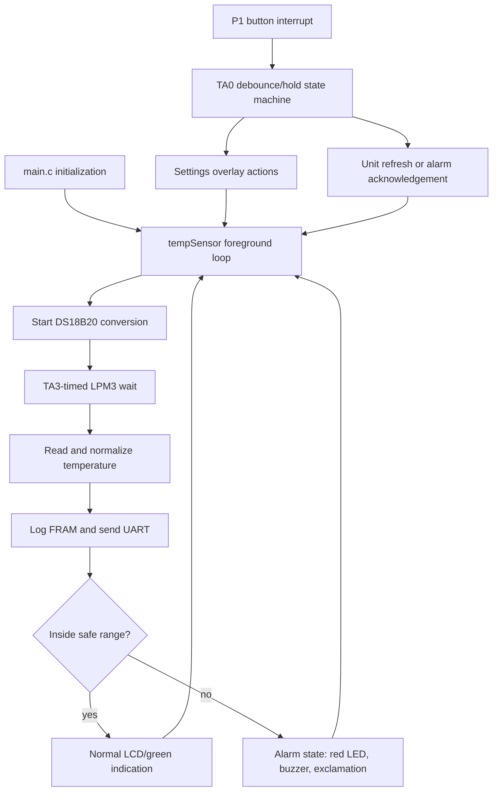

# Medicine Temperature Monitor

Low-power medicine temperature monitor firmware for the Texas Instruments
MSP430FR6989 LaunchPad. The current prototype reads an external DS18B20,
shows the temperature on the LaunchPad's segmented LCD, logs samples in FRAM,
and raises a visible and audible alarm when the reading leaves a configured
safe range.

This README is both project documentation and an AI handoff. It describes the
code as it exists today, including unfinished features and constraints that
future changes must preserve. When the architecture changes, update this file
in the same change.

## Project goals

The long-term goal is a reliable, battery-powered monitor for temperature-
sensitive medicine. It should eventually:

- run for months or years by spending most of its time in a low-power mode;
- let the user configure temperature limits and other settings;
- retain temperature history and out-of-range duration in FRAM;
- clearly warn the user without losing measurements or history;
- recover predictably from resets and power loss; and
- be engineered and documented as a portfolio-quality embedded system.

This is still prototype firmware, not a validated medical device. Sampling is
intentionally frequent, several settings are display-only placeholders, and
sensor fault handling and production-level testing are not implemented yet.

## Current behavior

### Normal monitoring

1. Start a DS18B20 conversion.
2. Turn the green LED on for 50 ms, then turn it off.
3. Sleep in LPM3 for the rest of the sensor's 750 ms conversion window.
4. Read the sensor, round the result to tenths of a degree Celsius, and append
   it to the FRAM ring buffer.
5. Transmit the Fahrenheit value over the UART backchannel.
6. Update the LCD unless the settings overlay owns it.
7. Sleep for an additional one second, then repeat.

The resulting prototype cadence is approximately one sample every 1.75
seconds. `TEMP_NORMAL_UPDATE_TICKS` is deliberately short and should be much
larger in a battery-powered deployment.

The LCD displays one decimal place with a fixed degree symbol and `C` or `F`.
S2 changes the displayed unit immediately; it does not wait for another sensor
conversion.

### Alarm behavior

The default safe range is inclusive: 2.0 degC through 8.0 degC. A completed
sample below or above those limits starts the alarm:

- the green measurement LED stays off;
- the red LED and passive-buzzer tone pulse for 100 ms;
- the pulse is followed by 650 ms off;
- the LCD exclamation icon is enabled;
- the settings overlay closes so the alarm temperature is visible; and
- sampling repeats as soon as each 750 ms DS18B20 conversion completes.

Pressing either S1 or S2 acknowledges the alarm. That physical press is
consumed, so it cannot also change a setting or temperature unit. After an
acknowledgement, the alarm remains disarmed while the temperature is still out
of range. One later in-range sample rearms it.

### Buttons and settings

Both LaunchPad buttons are active-low and use interrupt-driven debouncing.

| Context | S1 | S2 |
| --- | --- | --- |
| Normal display, short press | Feedback beep only | Toggle C/F immediately |
| Normal display, 1 s hold | Enter settings | No long-hold action |
| Settings, short press | Select option (currently a no-op) | Next option |
| Settings, 1 s hold | Exit settings | Exit settings |
| Active alarm, any press | Acknowledge and consume press | Acknowledge and consume press |

Entering settings scrolls `SETTINGS` across the six-character LCD in 200 ms
steps, then displays `ALARM`, `SCALE`, `VOLUME`, or `HSTRY`. The menu is an LCD
overlay, not a separate application mode. Temperature conversion, alarm
checking, UART output, and FRAM logging continue behind it.

The option editors are not implemented. `settingsModeSelectOption()` is
intentionally a no-op, and `HSTRY` is the six-character label for `HISTORY`.

### Temperature history

Every completed reading is stored as signed tenths of a degree Celsius in a
64-entry FRAM ring buffer. Its magic value, next index, count, and samples
survive an ordinary reset because `temperatureHistoryLog` uses TI's
`PERSISTENT` pragma. A firmware download may erase or replace this data.

There is not yet a history UI, timestamp, checksum/CRC, export function, or
out-of-range-duration calculation. The ring buffer type and helper functions
currently live inside `TempSensorMode.c`.

## Hardware

### Main platform and toolchain

- Board: TI MSP-EXP430FR6989 LaunchPad
- MCU: MSP430FR6989, 16-bit FRAM microcontroller
- IDE: Code Composer Studio 21.0.0 on Windows 11
- Compiler: TI MSP430 Code Generation Tools 21.6.2 LTS
- SDK origin: MSP430Ware 3.80.14.01 out-of-box LaunchPad example
- Display: onboard FH-1138P six-character segmented LCD
- Debug/programming: onboard eZ-FET over Micro-USB, using Spy-Bi-Wire

The project includes the needed MSP430FR5xx/6xx DriverLib sources under
`Smart Monitor/driverlib`; it is not a SysConfig project.

### Connections and pin ownership

| Function | MSP430 resource | LaunchPad connection | Notes |
| --- | --- | --- | --- |
| DS18B20 data | P1.4 | J2.7 | One-wire bus; use an external pull-up, normally 4.7 kohm to 3.3 V |
| Passive buzzer PWM | P1.3 / TA1.2 | J4.1 | Approximately 2.048 kHz; output is active-high PWM |
| Red alarm LED | P1.0 | Onboard LED1 | Active high |
| Green measurement LED | P9.7 | Onboard LED2 | Active high |
| S1 | P1.1 | Onboard S1 / J1.6 | Active low, internal pull-up |
| S2 | P1.2 | Onboard S2 / J1.5 | Active low, internal pull-up |
| UART TX | P3.4 / UCA1TXD | eZ-FET backchannel | J101 TXD jumper must be present |
| UART RX | P3.5 / UCA1RXD | eZ-FET backchannel | Configured but not currently read; J101 RXD jumper must be present |
| LCD | LCD_C segment pins | Onboard LCD | Driven by `hal_LCD.c` |
| Low-frequency crystal | PJ.4/PJ.5 | Onboard 32.768 kHz LFXT | Supplies ACLK in LPM3 |

The source comment currently permits a small passive piezo directly between
P1.3 and ground. For a buzzer or module whose current can exceed a GPIO's
rating, use a correctly biased transistor driver with a common ground; never
power the buzzer from an MCU GPIO.

Use only one source for each power rail. In particular, do not connect an
external regulated 3.3 V supply in parallel with the eZ-FET 3.3 V regulator.
Remove the J101 3V3 isolation jumper before externally powering the target
3.3 V rail unless the power arrangement has been intentionally designed to
prevent backfeeding. Always establish a common ground, verify polarity and
voltage with power off, and check for shorts before reconnecting USB.

## Software architecture

The program has one active monitoring mode. The old `mode` variable and some
RTC/stopwatch names remain from TI's out-of-box demo, but no stopwatch feature
is currently reachable.



### Module map

| Path | Responsibility |
| --- | --- |
| `Smart Monitor/main.c` | Startup, GPIO/clocks/UART initialization, foreground entry, P1 button ISR, TA0 button/scroll state machine, and legacy RTC ISR |
| `Smart Monitor/TempSensorMode.c/.h` | Monitoring loop, LPM3 scheduling, display formatting, alarm state, LED/buzzer control, thresholds, and persistent FRAM history |
| `Smart Monitor/SettingsMode.c/.h` | Nonblocking settings overlay, intro scroll, option navigation, and LCD render requests |
| `Smart Monitor/ds18b20.c/.h` | P1.4 one-wire transactions, conversion commands, sensor reads, and TA2-based microsecond delay |
| `Smart Monitor/hal_LCD.c/.h` | LaunchPad LCD_C initialization, character segment maps, positions, clear/write helpers, and a legacy blocking scroll helper |
| `Smart Monitor/debug.c/.h` | Blocking UART character, string, integer, and float transmit helpers |
| `Smart Monitor/driverlib/` | Vendored TI MSP430FR5xx/6xx DriverLib; do not modify for application features |
| `Smart Monitor/lnk_msp430fr6989.cmd` | Device memory map, interrupt vectors, MPU definitions, and `.TI.ramfunc` FRAM-to-RAM copy support |
| `Smart Monitor/targetConfigs/MSP430FR6989.ccxml` | CCS/eZ-FET target configuration |
| `.vscode/` | C/C++ IntelliSense plus CCS build, clean, and flash tasks |
| `AGENTS.md` | Repository-specific rules for AI coding agents |

`Smart Monitor/main.pp` and everything under `Smart Monitor/Debug/` are
generated build products. They are ignored by Git and are not source files.

### Foreground and interrupt boundary

LCD writes, sensor result processing, history writes, and most state
transitions run in foreground code. Interrupt handlers record short events,
advance timing state, stop one-shot timers, request display work, and wake the
foreground loop. Keep slow formatting and multi-character LCD rendering out
of interrupt handlers.

The settings renderer uses request flags so the temperature loop can service
it whenever a button interrupt wakes the MCU during an LPM3 delay. One-wire
reset/read/write transactions briefly disable interrupts because their bit
slots are timing-sensitive; the 750 ms conversion wait itself remains
interruptible and uses LPM3.

### Clock and timer ownership

Clock assumptions are part of the timing design:

- DCO: 8 MHz
- MCLK: 1 MHz (DCO divided by 8)
- SMCLK: 1 MHz (DCO divided by 8)
- ACLK: 32,768 Hz from the onboard LFXT crystal

Do not reuse a timer without redesigning all of its existing clients.

| Resource | Clock | Exclusive use |
| --- | --- | --- |
| Timer_A0 CCR0 | ACLK | 20 ms button debounce/hold ticks; switches to 200 ms ticks while only the settings intro scroll needs it |
| Timer_A1 CCR0/CCR2 | ACLK | Hardware PWM tone on P1.3 for both alarm and button feedback |
| Timer_A2 | SMCLK | Busy-wait microsecond timing for the one-wire driver |
| Timer_A3 CCR0 | ACLK | One-shot LPM3 sleep for conversion, normal interval, and alarm phases |
| Timer_B0 CCR0 | ACLK | 100 ms one-shot timeout for the button feedback beep |
| RTC_C | n/a | Held/stopped; the remaining RTC ISR is legacy code |

Alarm and button sounds share Timer_A1 through two request flags. Preserve the
central arbitration in `updateBuzzerOutput()` so ending a feedback beep cannot
silence an alarm that still requests the tone.

### Low-power implementation

All long waits in the monitoring loop use `sleepForAclkticks()` and LPM3. The
MSP430FR6989 PMM32 erratum requires LPM3/LPM4 entry code to execute from RAM
after FRAM is put into its inactive state. `enterLpm3FromRam()` is therefore
placed in `.TI.ramfunc`, and the linker command file copies that section into
RAM during startup. Do not replace this helper with a plain
`__bis_SR_register(LPM3_bits | GIE)` without re-evaluating the erratum.

The current code favors correct prototype interaction over minimum energy.
UART transmission is polling/blocking, floating-point conversion is used, and
the normal sample interval is only one second beyond the sensor conversion.
Measure with EnergyTrace before claiming a battery-life improvement.

## Configuration reference

These are the main knobs a future task is likely to change:

| Symbol | Current value | Location | Meaning |
| --- | ---: | --- | --- |
| `temp_alarm_low_tenths_c` | 20 | `TempSensorMode.c` | Low threshold, 2.0 degC |
| `temp_alarm_high_tenths_c` | 80 | `TempSensorMode.c` | High threshold, 8.0 degC |
| `TEMP_NORMAL_UPDATE_TICKS` | 32768 | `TempSensorMode.h` | Extra normal delay: 1 s |
| `TEMP_ALARM_UPDATE_TICKS` | 0 | `TempSensorMode.h` | Extra alarm delay after conversion |
| `DS18B20_CONVERSION_TICKS` | 24576 | `TempSensorMode.c` | 750 ms conversion wait |
| `MEASUREMENT_LED_ON_TICKS` | 1638 | `TempSensorMode.c` | About 50 ms green flash |
| `ALARM_ON_TICKS` | 3277 | `TempSensorMode.c` | About 100 ms red/tone pulse |
| `ALARM_OFF_TICKS` | 21299 | `TempSensorMode.c` | About 650 ms between pulses |
| `BUTTON_TIMER_INTERVAL_MS` | 20 | `TempSensorMode.h` | Button sampling/debounce period |
| `BUTTON_LONG_PRESS_MS` | 1000 | `TempSensorMode.h` | Long-press threshold |
| `BUTTON_RELEASE_DEBOUNCE_MS` | 40 | `TempSensorMode.h` | Stable release time |
| `BUTTON_FEEDBACK_BEEP_MS` | 100 | `TempSensorMode.h` | Button tone duration |
| `SETTINGS_SCROLL_STEP_MS` | 200 | `SettingsMode.h` | Settings intro frame period |
| `TEMPERATURE_HISTORY_CAPACITY` | 64 | `TempSensorMode.c` | Number of retained samples |

All alarm limits and stored readings use tenths of a degree Celsius. Keep one
canonical unit internally and convert only at presentation boundaries.

## Build, flash, and debug

### VS Code

Open the repository root, not the `Smart Monitor` subdirectory. Install the
recommended Microsoft C/C++ extension when prompted. The checked-in VS Code
configuration supplies MSP430 headers and target defines for IntelliSense;
CCS remains the authoritative compiler and linker.

- Build: press `Ctrl+Shift+B` and choose `CCS: Build Smart Monitor (Debug)`.
- Clean: run `Tasks: Run Task` -> `CCS: Clean Smart Monitor (Debug)`.
- Build and program: run `Tasks: Run Task` ->
  `CCS: Build and Flash Smart Monitor (Debug)`.

The tasks assume CCS is installed at `C:/ti/ccs2100`. The flash task expects
the build output at `Smart Monitor/Debug/Smart Monitor.out` and the onboard
eZ-FET described by `Smart Monitor/targetConfigs/MSP430FR6989.ccxml`.

VS Code squiggles are static IntelliSense diagnostics, not a substitute for a
real TI compiler build. Conversely, `Smart Monitor/.clangd` is generated by
CCS and suppresses clangd diagnostics; this repository intentionally uses the
Microsoft C/C++ extension instead of a clangd extension.

### Code Composer Studio

Open/import `Smart Monitor` as the existing CCS managed-build project and use
the `Debug` configuration. The project targets `MSP430FR6989` through the `TI
MSP430 USB1` connection. Build before starting a debug session.

When source changes while a debug session is already open, rebuild and load
the newly generated program before restarting it. Restart alone reruns the
previously loaded image.

Do not manually edit `.project`, `.cproject`, `.ccsproject`, or `.settings` to
change CCS configuration. Use CCS project tooling so its generated metadata
stays internally consistent.

### UART monitor

Use the Windows COM port named `MSP Application UART1` (COM10 on the original
development machine) with:

- 9600 baud
- 8 data bits
- no parity
- 1 stop bit
- no flow control

The firmware currently transmits Fahrenheit with two printed decimal places
and the letter `F`, regardless of the LCD unit. It does **not** send CR or LF,
so successive readings appear concatenated. The printed precision is also
higher than the sensor path's effective resolution; do not interpret the
second digit as additional accuracy.

## Design rules for future changes

Future contributors and coding agents should preserve these invariants unless
a task explicitly includes redesigning them:

1. Settings remains a nonblocking LCD overlay; monitoring, logging, and alarm
   evaluation continue while it is visible.
2. The measurement loop, not an ISR, owns DS18B20 results, FRAM log writes,
   alarm evaluation, and full LCD rendering.
3. Long waits use ACLK and LPM3. Preserve the PMM32 RAM-resident entry helper.
4. Preserve timer ownership or document and verify a deliberate redesign.
5. Preserve Timer_A1 tone-request arbitration between alarm and feedback.
6. One-wire timing-critical transactions may mask interrupts briefly, but the
   sensor conversion delay must remain interruptible.
7. An alarm acknowledgement consumes the whole button press and remains
   disarmed until an in-range sample rearms it.
8. Store temperatures and thresholds in one canonical fixed-point Celsius
   representation; presentation may use C or F.
9. Do not modify vendored DriverLib for application behavior.
10. Do not hand-edit CCS-managed project metadata.
11. Keep hardware-dependent pin, clock, timer, and power assumptions explicit
    in code comments and in this README.
12. Treat low power, reliability, recoverability, and testability as product
    requirements, not optional cleanup.

## Known limitations and likely next work

- `ALARM`, `SCALE`, `VOLUME`, and `HSTRY` have no option editors yet.
- Thresholds and selected display unit are not persisted as user settings.
- History has no timestamps, UI, export, integrity check, or duration summary.
- The DS18B20 driver uses Skip ROM and therefore assumes exactly one sensor.
- The driver does not verify presence, scratchpad CRC, disconnected-bus data,
  or conversion completion.
- The driver never writes the DS18B20 resolution configuration. It waits the
  12-bit maximum conversion time but relies on the sensor's existing/default
  configuration.
- The current read path effectively represents temperature in 0.125 degC
  steps before rounding to 0.1 degC, so it does not preserve the full 12-bit
  raw resolution.
- UART output is blocking, always Fahrenheit, and has no record delimiter.
- The display path has only one decimal place and limited range formatting.
- Several names and the RTC ISR are legacy residue from TI's stopwatch demo.
- There are no automated host tests, hardware-in-the-loop tests, or recorded
  power measurements yet.

These are documented facts, not blanket permission to fix them during an
unrelated task. Keep changes scoped to the requested outcome.

## AI coding-agent handoff

### Minimum context to read

An AI working in this repository should begin with:

1. `README.md` for system behavior, architecture, and constraints.
2. `AGENTS.md` for repository-specific working rules.
3. Only the source modules involved in the requested behavior.

For TI/CCS work in the configured development environment, also follow:

- `C:/ti/ccs2100/ccs/theia/resources/ai/CCS.md`
- `C:/ti/ccs2100/ccs/theia/resources/ai/sdks/MSP430WARE/AGENTS.md`
- `C:/ti/ccs2100/ccs/theia/resources/ai/boards/MSP-EXP430FR6989/AGENTS.md`

Before editing, inspect the current implementation and `git status`; this is
an actively developed worktree and unrelated user changes must be preserved.
After editing firmware, run the CCS Debug build and report the exact result.
Hardware-dependent behavior that cannot be exercised locally should be handed
off as a short, concrete bench-test procedure.

### Efficient task prompt template

Use this when asking Codex to implement a change. Replace the brackets and
delete irrelevant lines; do not paste the whole source tree into the prompt.

```text
Read README.md and AGENTS.md first. Treat README.md as current system context.

Task: [one observable outcome]

Current behavior:
- [what happens now]

Required behavior:
- [precise behavioral delta]

Relevant area:
- [likely files, functions, pins, timers, or state if known]

Must preserve:
- [specific README invariants relevant to this task]
- [behavior that must not regress]

Out of scope:
- [nearby features or refactors not requested]

Acceptance criteria:
1. [observable or measurable result]
2. [edge case]
3. [power/timing/persistence requirement, if applicable]

Verification:
- Build the CCS Debug configuration and report errors/warnings.
- [specific bench test or static check]

Inspect the current code before editing, make the smallest coherent change,
preserve unrelated worktree changes, and update README.md only if behavior,
architecture, hardware mapping, configuration, or limitations change. Ask a
question only if a missing decision would materially change the implementation.
```

A useful prompt describes the desired external behavior and constraints, not
an unverified implementation recipe. Mention exact symbols when known, but let
Codex inspect their current definitions before changing them.

### Meta-prompt for another LLM

If another LLM is helping turn an idea into a Codex request, send it this
README plus the following instruction:

```text
Using the supplied README as the source of truth, turn my request into one
implementation-ready prompt for Codex. Output only that prompt. Keep it
compact: do not repeat general project context already in README.md. Include
the observable outcome, current-versus-required behavior, only the relevant
files/symbols and architecture invariants, explicit non-goals, acceptance
criteria, build verification, and any necessary hardware bench test. Do not
invent missing hardware facts. Ask me at most one clarification before writing
the prompt, and only if different answers would materially change the design.

My request: [describe the change here]
```

### How to avoid wasting agent context and credits

- Give one coherent task per prompt.
- Refer to this README instead of retelling the board and architecture.
- State the observed problem and desired result; include exact logs only when
  they are evidence for that task.
- Point to likely modules or symbols, but do not paste entire files.
- Define what must not change and what is out of scope.
- Use measurable acceptance criteria instead of "make it better."
- Say whether hardware verification is possible and exactly what to observe.
- Request a build once after the coherent edit rather than after every tiny
  patch, unless an intermediate build is needed to isolate a failure.
- Avoid combining implementation with broad cleanup, renaming, or speculative
  optimization.

## Reference documents

- [MSP-EXP430FR6989 LaunchPad Development Kit User's Guide (SLAU627)](https://www.ti.com/lit/pdf/slau627)
- [MSP430FR58xx/59xx/68xx/69xx Family User's Guide (SLAU367)](https://www.ti.com/lit/pdf/slau367)
- [MSP430FR6989 device page and datasheet](https://www.ti.com/product/MSP430FR6989)
- [MSP430FR6989 device errata, including PMM32](https://www.ti.com/lit/pdf/slaz517)
- [DS18B20 datasheet](https://www.analog.com/media/en/technical-documentation/data-sheets/ds18b20.pdf)
