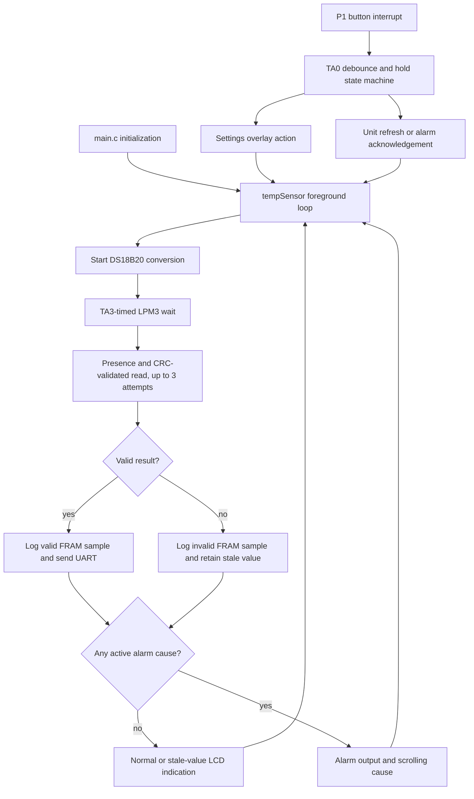

# Architecture and design

## Context and goals

The firmware is a single-application embedded system: it repeatedly measures
temperature, validates and stores the result, evaluates alarms, updates the
display, and sleeps. Settings and alarm messages are nonblocking overlays, not
separate application modes.

The design prioritizes low power, deterministic timing, data retention,
recoverability, and clear ownership between foreground code and interrupts.

## High-level data flow

For the user-visible rules behind these states, see
[Firmware behavior](firmware-behavior.md). For the sensor transaction details,
see [Sensors and drivers](sensors-and-drivers.md).

## Module map

| Path | Responsibility |
| --- | --- |
| `Smart Monitor/main.c` | Startup, GPIO/clocks/UART initialization, foreground entry, P1 button ISR, TA0 button/scroll state machine, and legacy RTC ISR |
| `Smart Monitor/TempSensorMode.c/.h` | Monitoring loop, LPM3 scheduling, display formatting, alarm state, LED/buzzer control, thresholds, and persistent history |
| `Smart Monitor/SettingsMode.c/.h` | Nonblocking settings overlay, intro scroll, option navigation, and LCD render requests |
| `Smart Monitor/ds18b20.c/.h` | One-wire transactions, sensor-power control, conversion commands, reads, and microsecond delay |
| `Smart Monitor/hal_LCD.c/.h` | LCD_C initialization, segment maps, positions, and display helpers |
| `Smart Monitor/debug.c/.h` | Blocking UART transmit helpers |
| `Smart Monitor/driverlib/` | Vendored TI MSP430FR5xx/6xx DriverLib; not application code |
| `Smart Monitor/lnk_msp430fr6989.cmd` | Memory map, vectors, MPU definitions, and `.TI.ramfunc` copy support |
| `Smart Monitor/targetConfigs/MSP430FR6989.ccxml` | CCS/eZ-FET target configuration |

The old `mode` variable and some RTC/stopwatch names remain from TI's
out-of-box example, but no stopwatch feature is reachable.

## Foreground and interrupt boundary

Foreground code owns:

- sensor-result processing;
- FRAM history writes;
- alarm evaluation and most state transitions;
- formatting and multi-character LCD rendering.

Interrupt handlers record short events, advance timing state, stop one-shot
timers, request display work, and wake the foreground loop. Settings and alarm
renderers use request flags so the foreground loop can service them after a
Timer_A0 or button interrupt.

One-wire reset, read, and write transactions briefly disable interrupts
because their bit slots are timing-sensitive. The 375 ms sensor-conversion
wait remains interruptible and uses LPM3.

## Clock and timer ownership

Clock assumptions are part of the timing design:

| Clock | Frequency | Source |
| --- | ---: | --- |
| DCO | 8 MHz | Digitally controlled oscillator |
| MCLK | 1 MHz | DCO divided by 8 |
| SMCLK | 1 MHz | DCO divided by 8 |
| ACLK | 32,768 Hz | Onboard LFXT crystal |

Do not reuse a timer without redesigning all of its clients.

| Resource | Clock | Exclusive use |
| --- | --- | --- |
| Timer_A0 CCR0 | ACLK | 20 ms button debounce/hold ticks; 200 ms ticks during settings-intro or alarm-cause scrolling |
| Timer_A1 CCR0/CCR2 | ACLK | Hardware PWM tone on P1.3 for alarm and button feedback |
| Timer_A2 | SMCLK | Busy-wait microsecond timing for the one-wire driver |
| Timer_A3 CCR0 | ACLK | One-shot LPM3 sleep for conversion, normal interval, and alarm phases |
| Timer_B0 CCR0 | ACLK | 100 ms one-shot timeout for button feedback beep |
| RTC_C | n/a | Held/stopped; remaining ISR is legacy code |

Alarm and button sounds share Timer_A1 through two request flags. Central
arbitration in `updateBuzzerOutput()` prevents an ending feedback beep from
silencing an active alarm request.

## Low-power design

All long monitoring waits use `sleepForAclkticks()` and LPM3. The
MSP430FR6989 PMM32 erratum requires LPM3/LPM4 entry code to execute from RAM
after FRAM enters its inactive state. `enterLpm3FromRam()` therefore lives in
`.TI.ramfunc`, and the linker copies that section into RAM at startup. Do not
replace it with a plain `__bis_SR_register(LPM3_bits | GIE)` without
re-evaluating the erratum.

The current implementation favors correct prototype interaction over minimum
energy: UART is polling/blocking, temperature conversion uses floating point,
and the normal interval adds only one second after each sensor conversion.
Quantification and measurement gates live in [Power budget](power-budget.md).

## Design invariants

Preserve these unless a task explicitly includes redesigning them:

1. Settings is a nonblocking overlay; monitoring, logging, and alarm evaluation
   continue while it is visible.
2. Foreground code, not an ISR, owns results, FRAM writes, alarm evaluation,
   and full LCD rendering.
3. Long waits use ACLK and LPM3, including the PMM32-safe RAM entry helper.
4. Timer ownership remains exclusive and documented.
5. Timer_A1 tone-request arbitration is shared by alarm and button feedback.
6. One-wire transactions may mask interrupts briefly; sensor conversion may
   not.
7. Alarm acknowledgement consumes the whole press. Each cause remains disarmed
   until its own condition clears.
8. Temperatures and thresholds use one fixed-point Celsius representation;
   conversion happens only at presentation boundaries.
9. Vendored DriverLib is not modified for application behavior.
10. CCS-managed project metadata is changed through CCS tooling, not by hand.
11. Pin, clock, timer, and power assumptions remain explicit in code and docs.
12. Low power, reliability, recoverability, and testability are product
    requirements.
13. The DS18B20 VDD and DQ pull-up are switched together so DQ cannot
    parasite-power the sensor.

